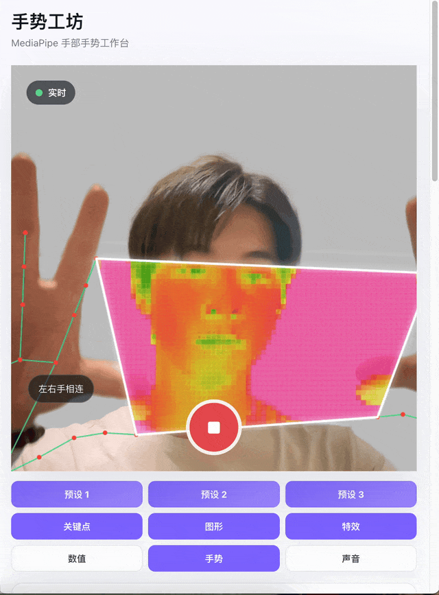

# Hand Gesture Studio

一个基于 Vite、JavaScript 和 MediaPipe Hand Gesture Recognizer 的浏览器手势视觉工作室。它支持摄像头手部识别、1:1 录制比例、参数预设、区域特效和声音映射，适合做互动视觉 demo、创意编码实验、教学展示和 AI coding 二次开发模板。

A browser-based hand gesture visual studio built with Vite, JavaScript, and MediaPipe Hand Gesture Recognizer. It includes webcam hand tracking, square recording controls, local presets, masked visual effects, and audio-reactive interaction mapping for demos, creative coding prototypes, education, and AI-assisted remixing.

<p align="center">
  
</p>

项目默认把 MediaPipe WASM 和手势模型放在 `public/mediapipe`，运行时不依赖 CDN。

## 隐私与摄像头

- 摄像头画面、手部关键点、手势结果和音频映射默认都在浏览器本地处理。
- 默认实现不会把视频、图片、音频、手部关键点或手势识别结果上传到服务器。
- 参数和 3 个预设保存在浏览器 `localStorage`，不会自动同步到云端。
- 如果你基于本项目加入后端上传、分析统计、账号系统或第三方 analytics，请在自己的产品中补充清晰的隐私说明和用户授权流程。

## 适合做什么

- 手势控制的网页 demo、创意编码实验、互动装置原型。
- 基于摄像头的教学、演示、舞台视觉或声音控制工具。
- 给 AI coding 助手二次开发的 starter template。

当前能力：

- 实时打开摄像头并识别左右手 21 个 hand landmarks。
- 使用拇指指尖 `landmark[4]` 和食指指尖 `landmark[8]` 生成连线、圆圈或双手相连区域。
- 把手指距离归一化成 `0-1` 数值，可用于 UI、声音或自定义交互。
- 支持 MediaPipe 原生手势：握拳、张开手掌、食指向上、点赞、倒赞、比耶、我爱你。
- 支持基于 landmarks 规则识别右手数字手势 `1-5`。
- 区域特效可手动选择：像素、流体玻璃、热成像、故障风。
- 支持 Web Audio 声音映射：左手控制高音节奏，右手控制低音脉冲。
- 支持参数保存、重置和 3 个浏览器本地预设。
- 支持 Netlify 静态部署。

## 快速开始

运行环境：

- Node.js `^20.19.0` 或 `>=22.12.0`
- 现代浏览器：Chrome、Edge、Safari、Firefox 的较新版本
- 摄像头权限
- 本地开发使用 `localhost`
- 线上摄像头访问需要 HTTPS

启动：

```bash
npm install
npm run dev
```

打开 Vite 输出的本地地址，通常是：

```text
http://localhost:5173
```

macOS 用户也可以双击项目根目录的 `start.command`。它会自动寻找可用端口、启动本地服务并打开页面。

## 验证

每次改动后至少运行：

```bash
npm test -- --run
npm run build
```

涉及摄像头、Canvas、WebGL 或声音的改动，还需要手动打开浏览器验证。

## 给 AI Coding 助手的项目说明

如果你要让 AI coding 助手继续开发这个项目，请先把下面这段说明发给它：

```text
这是一个纯前端 Vite + JavaScript + MediaPipe Hand Gesture Recognizer 项目。目标是基于浏览器摄像头做手势交互。

请先阅读 README.md 和 AI_CODING_GUIDE.md，再改代码。核心入口是 src/main.js，但不要把所有新逻辑都塞进 main.js；优先把纯计算、映射、配置放进独立模块并补测试。

运行命令：
npm install
npm run dev
npm test -- --run
npm run build

重要入口：
- src/projectConfig.js：模型路径、storage key、稳定帧配置
- src/main.js：摄像头、MediaPipe 初始化、每帧识别和绘制主流程
- src/handOverlay.js：手部几何、距离归一化、连线/圆圈/双手区域
- src/gestures.js：MediaPipe 手势标签、稳定逻辑、数字手势识别
- src/areaEffects.js：区域特效类型和像素特效参数
- src/audioMapping.js：Web Audio 声音映射
- src/settings.js：本地设置和预设持久化
- index.html：页面结构和控件
- src/styles.css：界面样式

开发约束：
- 保持本地 MediaPipe 资源路径可配置，不要默认依赖 CDN。
- 新增可保存参数时，同步 DEFAULT_SETTINGS、normalizeSettings()、applySettings()、getCurrentSettings()。
- 新增纯逻辑时补 Vitest 测试。
- 修改后运行 npm test -- --run 和 npm run build。
```

更详细的 AI 修改指南见 [AI_CODING_GUIDE.md](AI_CODING_GUIDE.md)。

## 常见二次开发任务

新增手势交互：

- 优先复用 `results.gestures` 中的 MediaPipe 原生分类结果。
- 如果需要更稳定的触发，用 [src/gestures.js](src/gestures.js) 里的 stabilizer 思路。
- 不要在绘制函数里散落复杂业务规则，建议独立成映射模块。

新增距离映射：

- 优先使用 [src/handOverlay.js](src/handOverlay.js) 的 `createNormalizedValues()`。
- `length` 范围是 `0-1`，适合驱动音量、速度、透明度、尺寸等参数。

新增区域特效：

- 先在 [src/areaEffects.js](src/areaEffects.js) 增加类型。
- 再在 [src/main.js](src/main.js) 的 `drawAreaEffect()` 接入绘制函数。
- 效果必须限制在圆圈或双手相连区域内，不能污染整张画面。

新增 UI 设置：

- 在 [index.html](index.html) 加控件。
- 在 [src/settings.js](src/settings.js) 加默认值和 normalize 逻辑。
- 在 [src/main.js](src/main.js) 的 `applySettings()` 和 `getCurrentSettings()` 同步读写。
- 如果是纯逻辑，补对应测试。

替换模型或 WASM：

- 改 [src/projectConfig.js](src/projectConfig.js) 的 `MEDIAPIPE_ASSETS`。
- 线上部署时模型和 WASM 需要从 HTTPS 同源地址加载。

## 项目结构

```text
.
├── AI_CODING_GUIDE.md
├── CONTRIBUTING.md
├── THIRD_PARTY_NOTICES.md
├── licenses/
│   └── Apache-2.0.txt
├── index.html
├── netlify.toml
├── public/
│   └── mediapipe/
│       ├── models/
│       │   └── gesture_recognizer.task
│       └── wasm/
│           ├── vision_wasm_internal.js
│           ├── vision_wasm_internal.wasm
│           ├── vision_wasm_nosimd_internal.js
│           └── vision_wasm_nosimd_internal.wasm
├── src/
│   ├── projectConfig.js
│   ├── main.js
│   ├── handOverlay.js
│   ├── gestures.js
│   ├── areaEffects.js
│   ├── audioMapping.js
│   ├── settings.js
│   ├── viewState.js
│   └── styles.css
├── start.command
└── deploy.command
```

## 部署到 Netlify

项目已包含 `netlify.toml`：

```toml
[build]
  command = "npm run build"
  publish = "dist"
```

部署到 Netlify 时会自动构建并发布 `dist`。`netlify.toml` 也为 MediaPipe WASM 文件设置了 `application/wasm` 响应头。

macOS 用户可以双击 `deploy.command`。首次部署前，先完成 Netlify 登录和站点绑定：

```bash
npx netlify login
npx netlify link
```

如果想部署后自动打开自己的线上地址，可以这样运行：

```bash
PRODUCTION_URL=https://your-site.netlify.app ./deploy.command
```

## 开源前注意

- 不要提交 `.netlify`、`.DS_Store`、`dist`、`node_modules`。
- 不要直接把整个本地文件夹 zip 后发布。
- 本仓库包含本地 MediaPipe runtime 和模型文件，分发或替换这些资源前请阅读 [THIRD_PARTY_NOTICES.md](THIRD_PARTY_NOTICES.md)。

## License

MIT
